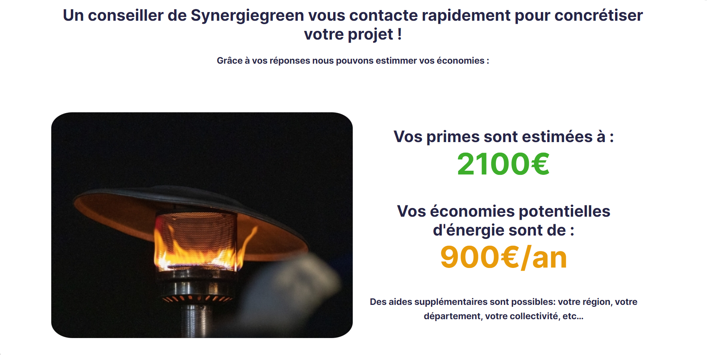
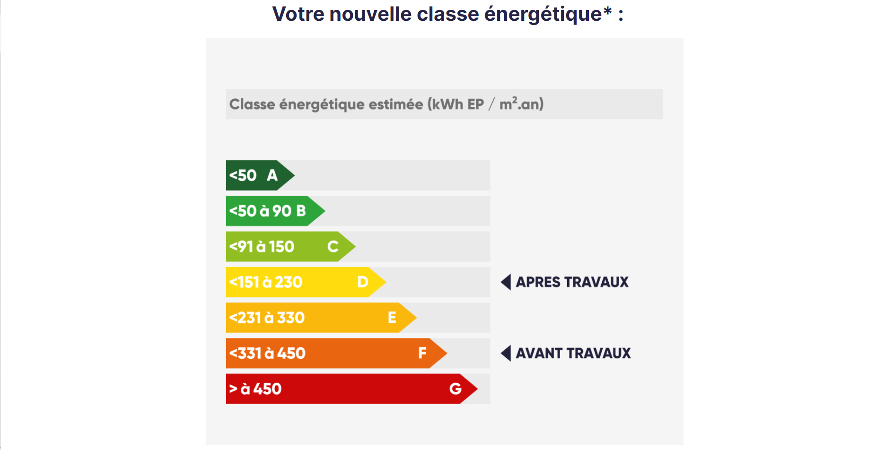

# Formulaire energie

This repo is a Wordpress plugin built upon  Formidable Forms Pro.
It computes the answers given in a form to calculate you energy savings.
//FR Dossier présentant un plugin Wordpress construit avec Formidable Forms Pro.
Il utilise les réponses entrées dans un formulaire pour calculer les économies d'énergie.

# Home page:

The Home page of the project:
//FR Page d'accueil

# Available forms:

Different forms are available:
//FR Différents formulaire disponibles

# Form questions:

About 10 pages of questions are asked:
//FR Environ 10 pages de questions sont posées

# Form result:

The answers are them used to calculate the energy savings:
//FR Les réponses sont utilisées pour calculer les résultats

